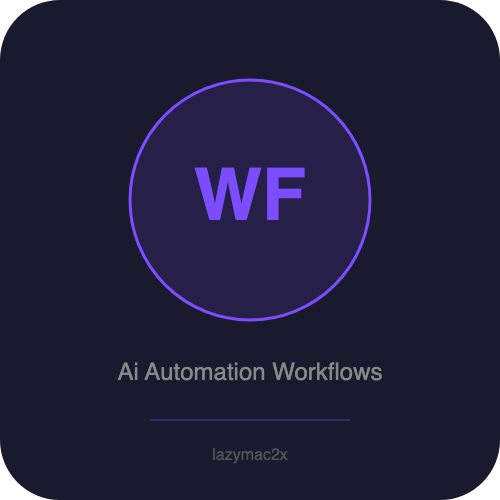

# AI Automation Workflows for n8n

**5 production-ready n8n workflow templates that save you 20+ hours of setup time.**

> Import, configure your API keys, and go. Each workflow is battle-tested with proper error handling, clean formatting, and real-world utility.

---

## What's Included

### 1. Crypto Signal to Telegram Bot
**File:** `workflows/crypto-signal-telegram.json`

Automatically fetch cryptocurrency trading signals from any API and receive formatted alerts on Telegram. Filters for BUY and STRONG_BUY signals only, so you never miss an opportunity.

- Schedule Trigger (every 4 hours, configurable)
- HTTP Request to any crypto signal API
- Smart filtering for actionable signals only
- Rich Telegram messages with price, confidence, indicators
- Silent logging when no signals found

**Integrations:** HTTP API, Telegram

---

### 2. RSS Feed to Social Media Auto-Post
**File:** `workflows/rss-to-social.json`

Turn any RSS feed into a social media content machine. AI reads each new article, generates platform-optimized posts with hashtags, and publishes to Twitter/X automatically. Logs everything to Slack.

- RSS Feed polling trigger
- AI-powered content summarization (OpenAI GPT-4o-mini)
- Platform-specific formatting (tweet length, LinkedIn style)
- Auto-generated relevant hashtags
- Slack notification log for every post

**Integrations:** RSS, OpenAI, Twitter/X, Slack

---

### 3. AI Email Auto-Responder
**File:** `workflows/email-ai-responder.json`

Classify incoming emails with AI, auto-draft contextual responses, and log everything to Google Sheets. Spam and newsletters are filtered out automatically. Sensitive emails are flagged for human review.

- IMAP email trigger (checks every 2 minutes)
- AI classification: inquiry, complaint, support, spam, newsletter, personal, urgent
- Sentiment analysis and confidence scoring
- AI-drafted responses matching the tone of the original
- Spam/newsletter auto-filtering
- Full audit log in Google Sheets

**Integrations:** IMAP, OpenAI, SMTP, Google Sheets

---

### 4. Website Change Monitor & Alert
**File:** `workflows/web-monitor-alert.json`

Monitor any webpage for content changes. Uses MD5 hashing to detect modifications and sends instant alerts via Telegram, Slack, and email simultaneously. Perfect for tracking competitor pricing, job postings, or product pages.

- Hourly schedule (configurable)
- Content extraction with HTML stripping
- MD5 hash comparison using n8n static data
- Triple-channel alerts: Telegram + Slack + Email
- Content preview in every alert
- Zero external dependencies (no database needed)

**Integrations:** HTTP, Telegram, Slack, Email (SMTP)

---

### 5. Daily Business Report Generator
**File:** `workflows/daily-report-generator.json`

Pull data from multiple sources (analytics, sales, social media), have AI generate an executive summary with insights and recommendations, then deliver a beautifully formatted report via email and Slack.

- Weekday schedule at 9:00 AM
- Parallel data fetching from 3 APIs
- Data aggregation and normalization
- AI-generated executive summary with actionable insights
- HTML-formatted email with gradient header
- Slack notification with full report

**Integrations:** HTTP APIs, OpenAI, Email (SMTP), Slack

---

## Quick Start

### Prerequisites
- **n8n** (self-hosted or cloud) - v1.0+
- **OpenAI API key** (for workflows 2, 3, 5)
- Relevant service accounts (Telegram bot, Slack app, etc.)

### Installation

1. Open your n8n instance
2. Go to **Workflows** > **Import from File**
3. Select any `.json` file from the `workflows/` folder
4. Configure credentials (marked as `REPLACE_ME` in each workflow)
5. Update environment variables or node parameters
6. Activate the workflow

See [SETUP_GUIDE.md](SETUP_GUIDE.md) for detailed per-workflow instructions.

---

## Environment Variables

All workflows support n8n environment variables for easy configuration:

| Variable | Used By | Description |
|----------|---------|-------------|
| `CRYPTO_SIGNAL_API_URL` | Workflow 1 | Your crypto signal API endpoint |
| `TELEGRAM_CHAT_ID` | Workflows 1, 4 | Telegram chat/group ID |
| `RSS_FEED_URL` | Workflow 2 | RSS feed to monitor |
| `SLACK_CHANNEL` | Workflows 2, 4 | Slack channel for notifications |
| `FROM_EMAIL` | Workflows 3, 4, 5 | Sender email address |
| `GOOGLE_SHEET_URL` | Workflow 3 | Google Sheet for logging |
| `MONITOR_URL` | Workflow 4 | Website URL to monitor |
| `ANALYTICS_API_URL` | Workflow 5 | Analytics data endpoint |
| `SALES_API_URL` | Workflow 5 | Sales data endpoint |
| `SOCIAL_API_URL` | Workflow 5 | Social metrics endpoint |
| `REPORT_RECIPIENTS` | Workflow 5 | Email recipients for daily report |
| `SLACK_REPORT_CHANNEL` | Workflow 5 | Slack channel for reports |

---

## Customization Tips

- **Change AI models:** Swap `gpt-4o-mini` for `gpt-4o` or any other model in the OpenAI nodes
- **Add Claude:** Replace OpenAI nodes with Anthropic nodes (same prompt structure works)
- **Adjust schedules:** Modify the Schedule Trigger node in each workflow
- **Add more channels:** Duplicate notification nodes and connect to new services
- **Chain workflows:** Use n8n's "Execute Workflow" node to connect these together

---

## Support

- Open an issue on [GitHub](https://github.com/lazymac2x/ai-automation-workflows/issues)
- n8n Community: [community.n8n.io](https://community.n8n.io)

---

## License

MIT License - use these workflows in personal and commercial projects.

Made with n8n + AI by [@lazymac2x](https://github.com/lazymac2x)
